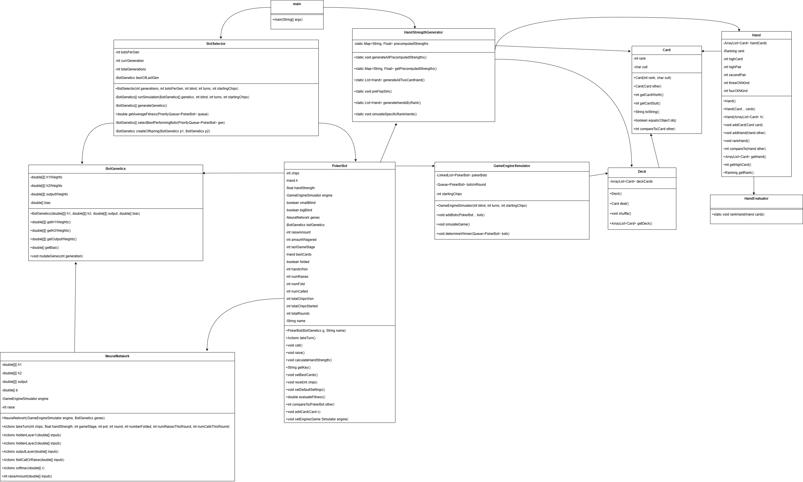

# Evolutionary Poker AI

A Texas Hold'em poker simulator that evolves neural-network poker bots using **neuroevolution** (genetic algorithms + feedforward neural networks). Bots compete in simulated games; the strongest strategies survive, mutate, and crossover across generations until strategies converge toward high-performing play.

**Built from scratch:** The feedforward neural network is implemented in plain Java (`NeuralNetwork.java`) — no TensorFlow, PyTorch, or other ML libraries. Forward pass, ReLU activations, softmax action selection, and raise sizing are all hand-coded.

**Course:** Harvard Extension School — Intro to Java II (Final Project)

---

## Overview

Poker is a game of incomplete information: players must make decisions under uncertainty while accounting for opponents' possible actions. Rather than hand-coding rules for when to bet, bluff, or fold, this project **learns** strategies by simulation.

The pipeline has three stages:

1. **Precompute hand strength** — Monte Carlo win-rate estimates for starting hands and made-hand categories (5,000 simulations each).
2. **Simulate games** — Bots play full Texas Hold'em hands using neural networks for fold / call / raise decisions.
3. **Evolve populations** — Top performers breed the next generation via elitism, mutation, and uniform crossover.

Over many generations, bot behavior converges: winning bots from later generations tend to employ similar, balanced strategies (mix of aggression, calls, and folds).

---

## How It Works

### Texas Hold'em simulation

`GameEngineSimulator` runs multi-hand games with:

- Small blind / big blind posting
- Hole cards, then betting rounds: **preflop → flop → turn → river**
- Pot management, raises, calls, and folds
- Showdown via best 5-card hand (hole cards + community cards)
- Early wins when all but one player folds
- Elimination of busted bots; play continues until one survivor or a round limit

### Neural network policy (implemented from scratch)

Each bot's brain is a **custom feedforward neural network** written without ML frameworks. Weights and biases live in `BotGenetics`; `NeuralNetwork.java` performs the full inference pipeline:

- **Matrix multiplication** across layers (9 → 16 → 8 → 4 outputs)
- **ReLU** on hidden units (`max(0, x)`)
- **Softmax** over fold / call / raise logits to pick an action
- **Dedicated raise neuron** for bet sizing when the network chooses `RAISE`

Training does not use backpropagation or gradient descent. Instead, **neuroevolution** tunes weights via selection, mutation, and crossover based on poker fitness — but the network architecture and forward pass are entirely original Java.

| Layer | Size | Activation |
|-------|------|------------|
| Input | 9 features | Normalized game state |
| Hidden 1 | 16 nodes | ReLU |
| Hidden 2 | 8 nodes | ReLU |
| Output | 3 action logits + 1 raise neuron | Softmax (actions); ReLU (raise amount) |

**Inputs:** chip stack ratio, hand strength, game stage, pot size, round progress, fold count, raise/call activity, and opponent stack pressure.

**Actions:** `FOLD`, `CALL`, or `RAISE` (with learned raise sizing on top of the table minimum).

See `NeuralNetwork.java` for the implementation.

### Hand strength lookup

`HandStrengthGenerator` builds a lookup map **before** evolution so bots get instant equity-like signals during play:

- **Preflop:** all 1,326 two-card combinations vs random opponent (random 3-card flop per trial).
- **Postflop:** representative 5-card hands per rank category (pair, two pair, flush, etc.) vs random 5-card hands.

Keys look like `Card: Ac Card: Kd ` (preflop) or `PAIR | 9` (made hands). Values are win probabilities in \([0, 1]\).

### Genetic algorithm

`BotSelector` manages evolution each generation:

| Step | Detail |
|------|--------|
| Evaluation | 1,000 five-bot tournaments per generation (random table assignments) |
| Selection | Top **40%** by fitness advance |
| Elitism | Top **10%** copied unchanged |
| Mutation | Next **30%** copied with weight/bias noise (rate decays over generations) |
| Crossover | Remaining **60%** filled via uniform crossover between parents from the top 40% |

**Fitness** rewards chip growth and hands won, and penalizes degenerate play (e.g. only folding, only raising, or extreme fold/raise rates).

After the final generation, the best bot's weights are written to `best_bot_weights.txt`.

---

## Architecture

```
main
 ├── HandStrengthGenerator   (Monte Carlo precompute)
 └── BotSelector             (genetic algorithm loop)
      ├── PokerBot           (agent + fitness)
      │    └── NeuralNetwork (policy)
      └── GameEngineSimulator (poker rules)
           ├── Hand / HandEvaluator
           ├── Deck / Card
           └── BotGenetics    (genome)
```



---

## Project structure

| File | Role |
|------|------|
| `main.java` | Entry point: precompute strengths, start evolution |
| `HandStrengthGenerator.java` | Monte Carlo hand-strength tables |
| `BotSelector.java` | GA loop: simulate, select, mutate, crossover |
| `GameEngineSimulator.java` | Full Hold'em game engine |
| `PokerBot.java` | Bot state, actions, fitness, best-hand selection |
| `NeuralNetwork.java` | **From-scratch** feedforward NN (ReLU, softmax, forward pass) |
| `BotGenetics.java` | Weight/bias genome and mutation |
| `Hand.java` / `HandEvaluator.java` | Hand representation and ranking |
| `Deck.java` / `Card.java` | Standard 52-card deck |
| `PokerBotUML.png` | Class diagram |

---

## Requirements

- Java 8 or later
- **No external dependencies** — no ML libraries; the neural network, poker engine, and genetic algorithm are self-contained

---

## How to run

From the project directory:

```bash
javac *.java
java main
```

**Default parameters** (in `main.java`):

| Parameter | Value |
|-----------|-------|
| Generations | 1,000 |
| Population size | 500 bots |
| Big blind | 6 |
| Max rounds per game | 200 |
| Starting chips | 240 |

**Note:** Startup precomputes hand strengths for all two-card hands and rank categories (5,000 simulations each). This can take several minutes before the evolution loop begins.

On completion, check `best_bot_weights.txt` for the evolved network weights of the top bot.

---

## Why this project?

- **Neural network from first principles** — understanding how inference works (layers, activations, softmax) without hiding it behind a framework.
- **Hard to hand-code optimal poker** — outcome space is huge; strategies depend on opponents and incomplete information.
- **Evolution discovers policies** — fitness comes from actual game results, not labeled training data.
- **Broader applications** — same ideas apply to decision-making under uncertainty (economics, business, multi-agent systems) where actors must reason about limited information and opponent behavior.

---

## Key results (observed behavior)

- Strategies **converge over generations** — late-generation winners share similar decision patterns.
- Fitness function encourages **balanced play** — bots that only fold, only call, or only raise score poorly.
- Evolved bots become **challenging simulated opponents** without explicit strategy rules.

---

## Author

**Deven Walsh** — [GitHub: dandsw](https://github.com/dandsw)

---

## License

Academic / portfolio project. Add a license file if you plan to open-source formally.
